<div align="center">

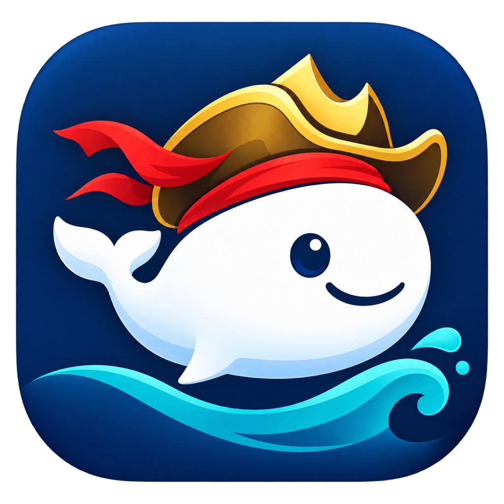

# 出海王输入法 · SailKing

**用熟悉的语言输入，让跨语言沟通发生在当前输入框。**

中文拼音 · 英文直输 · 本机翻译 · 确认后上屏

[](https://github.com/sapplex-sz/SailKing/actions/workflows/core-tests.yml)
[](LICENSE)


[获取安装包](https://github.com/sapplex-sz/SailKing/releases) · [快速开始](#快速开始) · [功能亮点](#功能亮点) · [使用方法](#使用方法) · [反馈问题](https://github.com/sapplex-sz/SailKing/issues)

</div>

出海王是一款原生 **Mac 系统输入法**，也提供独立的翻译工作台。日常输入时使用中文拼音或英文直输；需要跨语言沟通时，在当前输入框完成原文、预览译文，再由你确认上屏。适合客户沟通、商品介绍、跨境业务和多语言社媒交流。

**当前版本：0.3.6 (9)**，支持 **macOS 26+ / Apple Silicon**。源码已开放，正式 DMG 安装包正在准备 Developer ID 签名与 Apple 公证，尚未公开分发。下载状态以 [Releases](https://github.com/sapplex-sz/SailKing/releases) 为准。

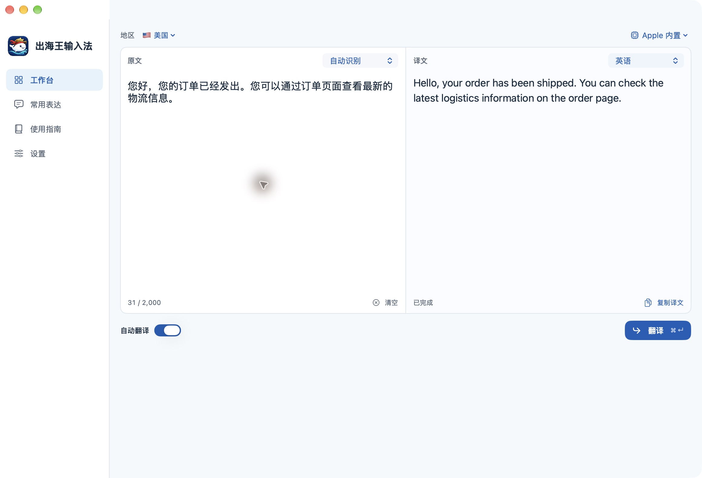

*真实运行截图：Apple 内置翻译将中文物流通知译为英文。页面内可选择语言、目标地区和翻译引擎。*

## 功能亮点

| 特色 | 你可以怎样使用 |
|---|---|
| **真正的系统输入法** | 添加到 macOS 键盘列表，在支持系统输入法的输入框中使用。中文拼音由 Rime 驱动，支持候选选择与本地词频学习。 |
| **中英文合为一个输入源** | 轻按 Shift 在中文拼音和英文直输之间切换，只需添加一个出海王输入源。 |
| **在输入框内翻译** | 开启翻译输入，完成选词后按 Return 生成译文，核对后再次 Return 上屏；不会代替你发送消息。 |
| **翻译在本机完成** | Mac 版使用 Apple 设备端翻译或本地 Hy-MT2 模型，无需填写翻译 API Key，原文不发送到翻译 API。 |
| **紧凑、可拖动的候选窗** | 按候选和译文内容调整空间。拖动标题或原文固定位置，跨应用和重启后保留；也可恢复跟随光标。 |
| **独立工作台与全局面板** | 长段落在工作台处理；按 Option + Space 打开翻译面板，也能配合你已有的输入法使用。 |
| **面向跨语言业务的常用表达** | 客户沟通、商品介绍、社媒互动三类短语，一键填入工作台；源语言可自动识别，目标语言与输入法共用。 |
| **完成前不误用旧译文** | 修改原文或切换语言会清除旧结果。翻译失败保留原文；检测到订单标识、链接或邮箱被改变时提示核对。 |
| **从安装到试打的新手引导** | 按“安装组件 → 加入键盘 → 试打拼音 → 可选翻译”完成设置。安装在当前用户目录，更新保留旧版本备份、词库和偏好。 |
| **源码可读、运行时可重建** | 原创代码采用 MIT 许可，包含原生推理运行时的构建脚本、依赖版本和校验信息。 |

普通拼音和英文输入不需要翻译模型。首次下载模型或 Apple 语言包需要网络，准备完成后可在本机翻译；可用语言组合取决于引擎、模型与已安装语言包。地区选择用于选择目标语言，不保证地区专属措辞。重要内容请核对译文。

## 界面一览

### 系统输入法候选窗

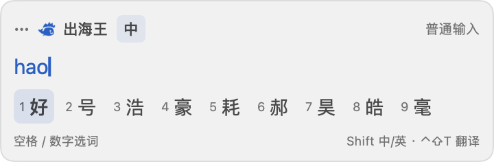

*当前候选窗口组件预览，使用示例拼音与候选展示布局。实际候选随输入内容变化。顶部提供中英文切换和翻译模式入口，标题与原文区域可以拖动。*

### 设置与常用表达

| 语言与引擎设置 | 业务常用表达 |
|---|---|
| 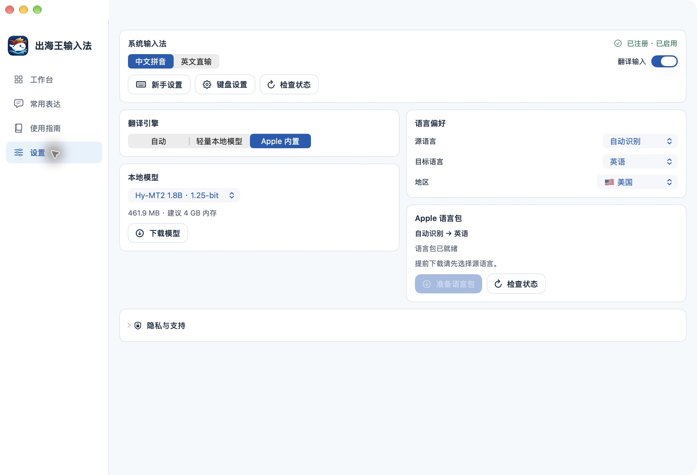 | 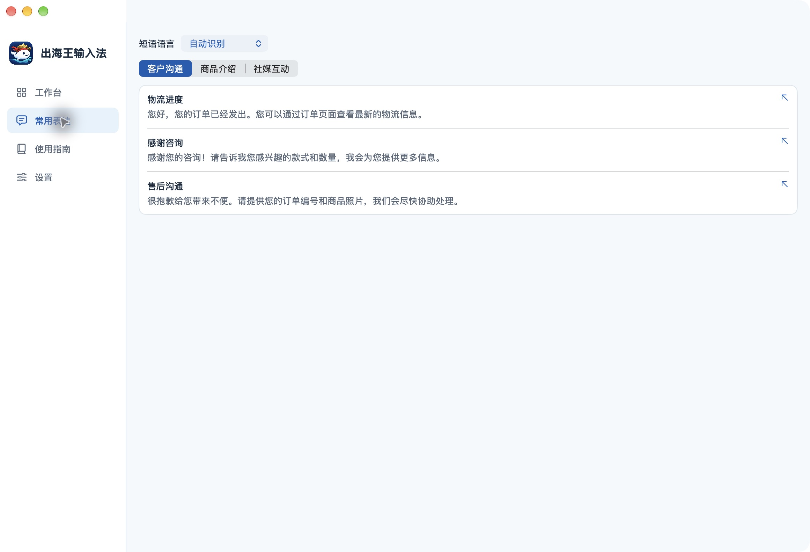 |
| 集中管理键盘状态、翻译引擎、模型和目标语言。 | 选择分类，点击短语即可填入工作台继续处理。 |

## 快速开始

### 1. 安装 App 与输入法组件

正式安装包将通过 [GitHub Releases](https://github.com/sapplex-sz/SailKing/releases) 分发。打开 DMG，把 **出海王输入法.app** 拖到“应用程序”，退出镜像后打开 App。

首次启动会显示新手设置，点击 **安装输入法组件**。App 已包含组件，无需单独下载安装另一个键盘。已安装的设备会显示“已安装在这台 Mac”，如下图。

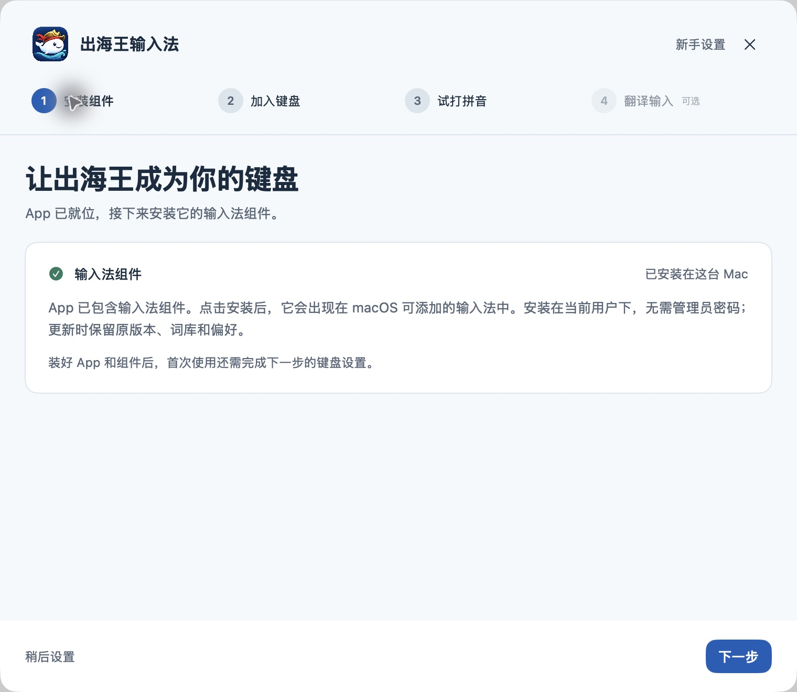

### 2. 加入系统键盘

在引导中点击 **打开键盘设置**，依次进入：

**系统设置 → 键盘 → 文字输入 → 编辑… → ＋ → 简体中文 → 出海王输入法 → 添加**。

只需添加一个输入源。确保 **在菜单栏显示输入法菜单** 已开启，然后在屏幕右上角选择出海王。英文系统中显示为 **SailKing**。App 本体不另外占用菜单栏图标。

| App 内的添加说明 | macOS 中的实际输入源 |
|---|---|
| 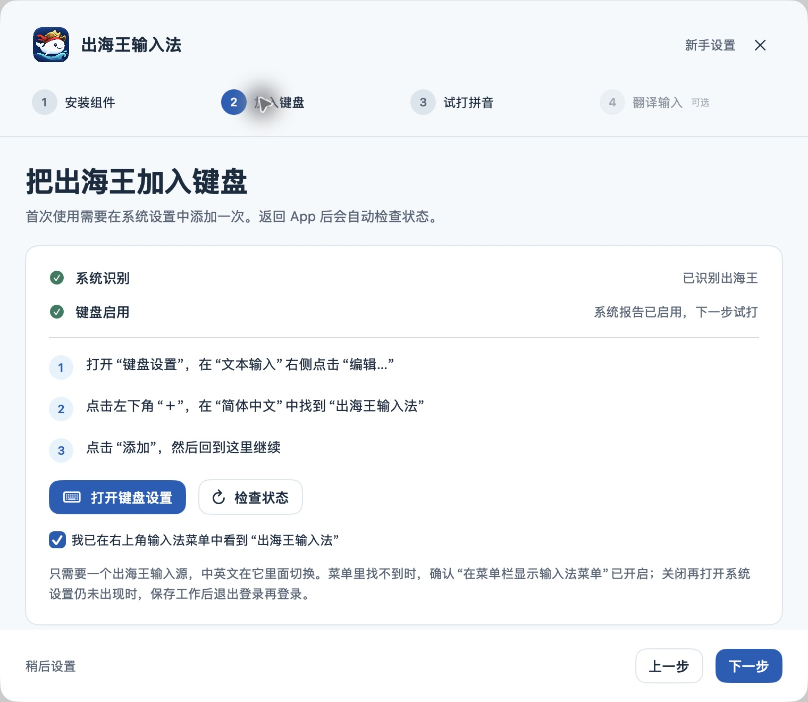 | 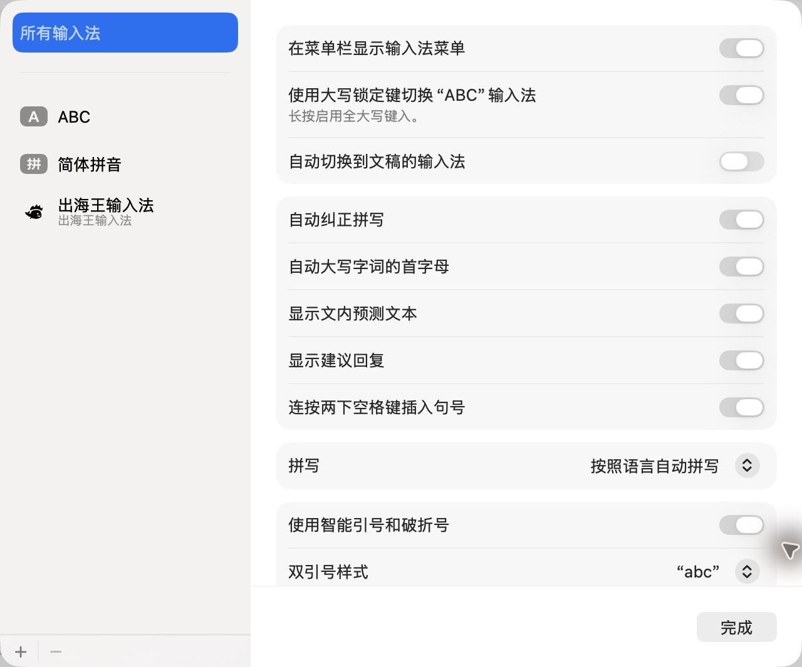 |

### 3. 输入第一句“你好”

点击 **切换并试打拼音**，在试打框中输入 `nihao`，按空格选择“你好”。这一步使用真实系统输入法；直接粘贴“你好”不会完成试打。

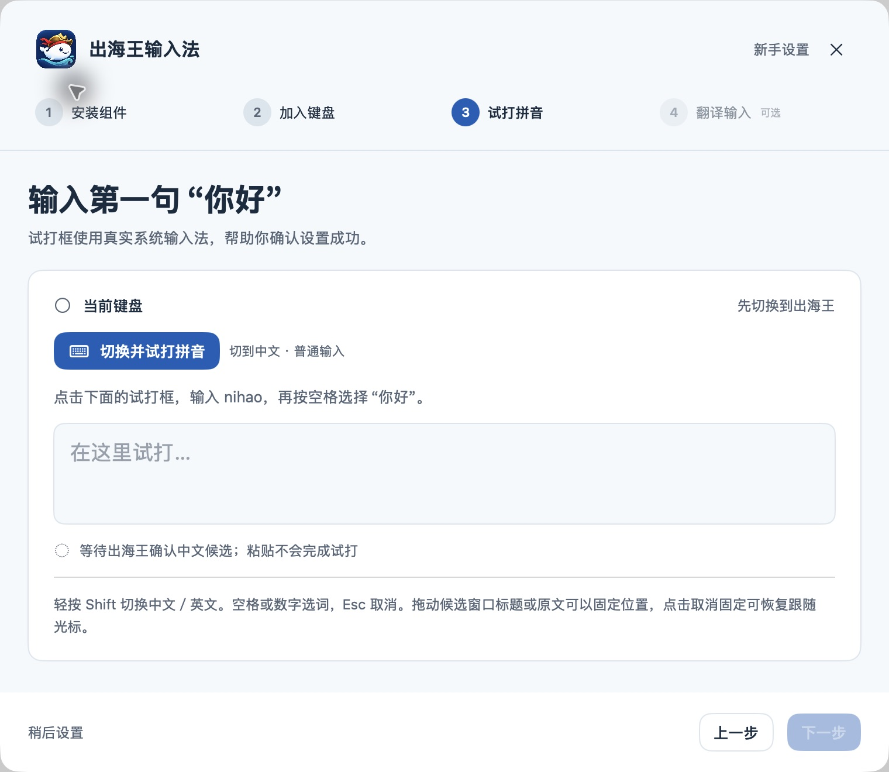

### 4. 按需准备翻译

在 **设置 → 翻译引擎** 中选择：

| 方式 | 准备工作 |
|---|---|
| **Apple 内置** | 选择源语言和目标语言，准备系统支持的语言包。自动识别源语言时可先输入文字再检查支持情况。 |
| **轻量本地模型** | 选择模型并下载。默认 Hy-MT2 1.8B · 1.25-bit 约 **462 MB**，建议至少 **4 GB 内存**；还提供约 **1.13 GB** 的 Q4 版本，建议至少 **8 GB 内存**。下载后检查大小和 SHA-256。 |

翻译准备是可选步骤，可以先使用普通拼音和英文。安装、更新和卸载的完整说明见 [安装指南](docs/INSTALLATION.md)。

## 使用方法

### 在当前输入框中翻译

1. 选择出海王输入法，按 **Control + Shift + T** 开启翻译输入。
2. 输入原文并完成拼音选词；按 **Return** 生成译文预览。
3. 核对译文，再次按 **Return** 确认上屏。发送消息仍由你在原应用中完成。
4. 按 **Esc** 返回修改或取消。翻译失败时可选择 **原文上屏**；尚未提交的草稿可从输入法菜单恢复。

切换输入框会取消旧译文，避免把前一个输入框的结果提交到另一个位置。输入法提交文字通过系统接口完成，不需要辅助功能权限。

### 在工作台中翻译

选择源语言、目标语言或地区，在左侧输入或粘贴原文。开启 **自动翻译** 时，完成选词并停顿后开始处理；也可按 **Command + Return** 手动翻译。译文完成后点击 **复制译文**，回到目标应用粘贴。

处理常用业务文案时，先打开 **常用表达**，选择“客户沟通 / 商品介绍 / 社媒互动”并点击短语，再到工作台调整内容、翻译和复制。

### 调整候选窗口位置

拖动候选窗的标题或原文区域即可固定位置，下一次输入仍在该位置显示。点击取消固定按钮，或在输入法菜单选择 **候选窗口跟随光标**，恢复自动定位。

### 配合已有输入法使用

按 **Option + Space** 打开全局翻译面板，使用你熟悉的系统输入法输入原文，核对译文后复制、返回原应用粘贴。需要自动粘贴时，可自行开启辅助功能权限。

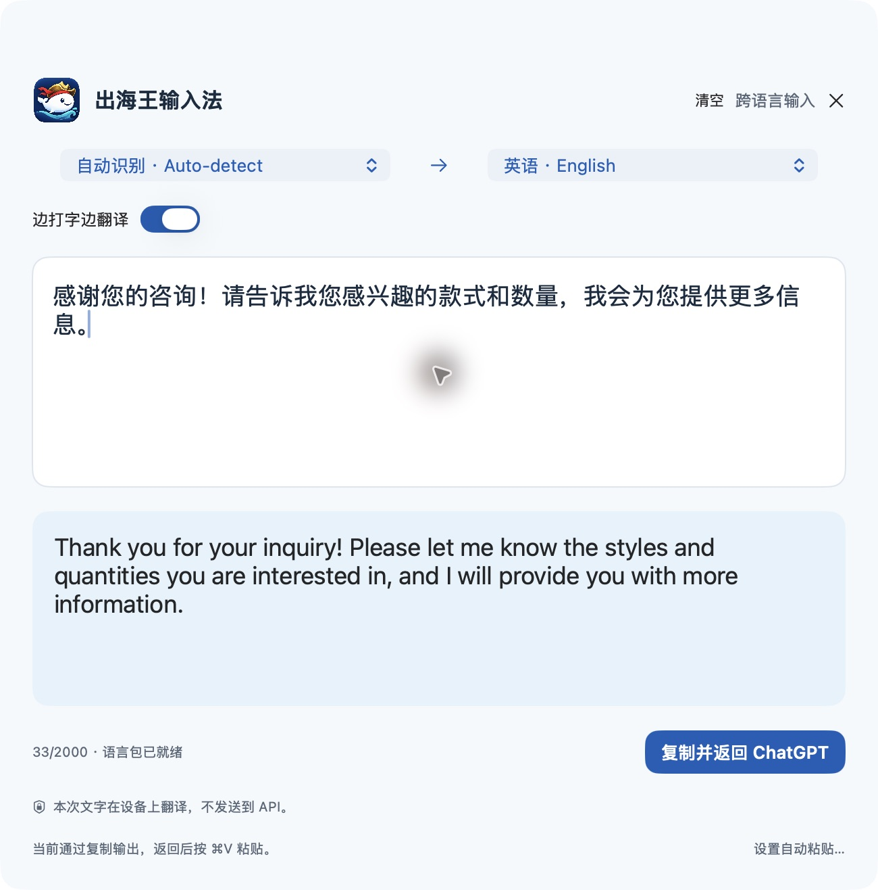

*真实运行截图：面板通过 Apple 内置引擎翻译咨询回复，提供“复制并返回”入口。也可从 App 的“跨语言输入”菜单打开。*

<details>
<summary>查看 App 内的输入与翻译指南截图</summary>

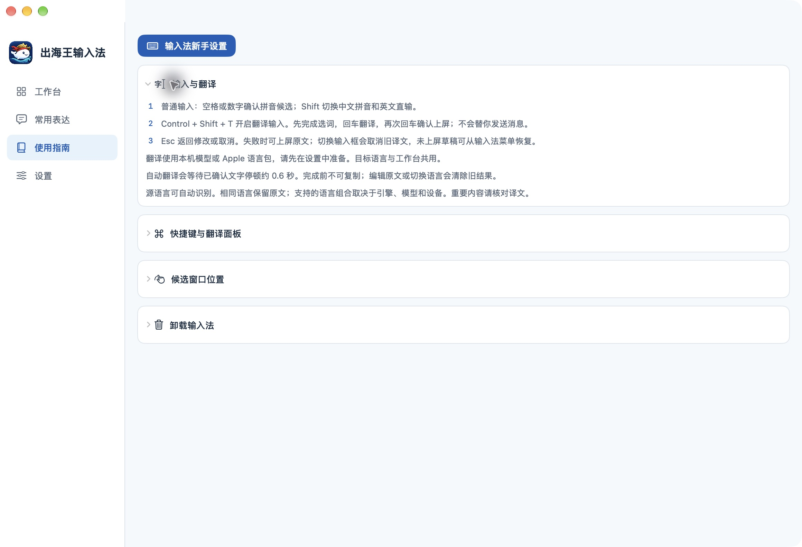

</details>

### 快捷键

| 操作 | 快捷键 |
|---|---|
| 中文拼音 / 英文直输 | **Shift**，或 **Control + Shift + Space** |
| 普通输入 / 翻译输入 | **Control + Shift + T** |
| 确认拼音候选 | **Space**、数字键或点击候选 |
| 生成译文预览 | 完成选词后按 **Return** |
| 确认译文上屏 | 译文完成后再按 **Return** |
| 返回修改或取消 | **Esc** |
| 工作台手动翻译 | **Command + Return** |
| 打开全局翻译面板 | **Option + Space** |

## 隐私与数据

Mac 版的输入文字通过本机模型或 Apple 设备端翻译处理，不发送到翻译 API。工作台不保存原文和译文历史；拼音引擎会在本机学习已确认词语、拼音和使用频次，学习记录可能包含输入内容。未上屏草稿仅在输入法进程运行期间暂存。

模型目录请求、模型下载和语言包准备需要网络。网络服务会收到建立连接必需的请求信息，但模型目录与下载请求不包含输入文字。完整说明见 [隐私说明](PRIVACY.md)。

## 常见问题

**装好 App 就能在键盘菜单中使用吗？**

首次使用还需安装 App 自带的输入法组件，再在系统键盘设置中添加出海王。新手引导会检查每一步；后续可从“使用指南”或“设置”重新打开。

**菜单里没有出海王怎么办？**

确认组件已安装、系统键盘中已添加出海王，并开启输入法菜单显示。仍未出现时，保存工作后退出登录再登录，让系统重新读取组件。

**是否支持 Intel Mac、Windows 或手机系统键盘？**

当前发布范围是 macOS 26+ 的 Apple Silicon Mac。仓库中的 iOS 翻译工作台为实验性内容，尚无 iOS 系统键盘扩展，不包含在 Mac 安装包中。其他平台暂未发布。

**如何更新或卸载？**

更新时退出旧 App、替换为新版，再通过新手设置更新组件。卸载时先切到 ABC，在系统键盘设置中移除出海王，再退出 App，将组件和 App 移到废纸篓。模型、偏好和用户词库保留。详细路径见 [安装、更新与卸载](docs/INSTALLATION.md)。

## 开发与贡献

欢迎通过 [GitHub Issues](https://github.com/sapplex-sz/SailKing/issues) 报告兼容性问题、提出改进建议，或提交 Pull Request。反馈请附系统版本、设备芯片、项目版本与可复现步骤，避免公开私人输入内容。

<details>
<summary>从源码构建与运行测试</summary>

需要 **Xcode 26+、Xcode 命令行工具、XcodeGen 和 Python 3**。项目配置以 `project.yml` 为准，生成的 Xcode 项目不纳入版本管理。

```bash
bash scripts/fetch-rime.sh
bash scripts/build-macos.sh
open "$HOME/Library/Developer/Haiwang/Preview/出海王输入法.app"
```

构建在非 iCloud 的本机缓存中进行。若当前登录会话已经启用出海王，构建会先停止，以免 Xcode 的重复登记移除现有键盘入口；请在独立用户会话中构建。已有产物可直接打包，无需重新构建。开发产物使用本机测试签名，正式公开安装包须另行完成 Developer ID 签名与 Apple 公证。

仓库提供 macOS arm64 原生运行时。自行重建时，安装 CMake 后运行 `bash scripts/build-runtime.sh`。运行时和 Rime 的版本、下载地址及校验值固定在构建脚本与清单中。

已有 App 可以通过 `bash scripts/package-release.sh` 制作 DMG；正式签名、公证与开发预览的操作见 [Mac 安装包发布流程](docs/MACOS_RELEASE.md)。打包不重新构建或登记输入源。

```bash
swift test --scratch-path "$HOME/Library/Developer/Haiwang/CoreTests"
bash Tests/WorkspaceSmoke/run.sh
bash Tests/CandidatePanelSmoke/run.sh
bash Tests/OnboardingSmoke/run.sh
bash Tests/RimeSmoke/run.sh
bash Tests/InputMethodSmoke/run.sh
bash Tests/InputMethodIPC/run.sh
```

核心测试在 GitHub Actions 上运行；原生界面、输入控制器与进程通信检查可在 Mac 本机运行。自动化检查使用隔离偏好和模拟客户端，真实输入框、系统菜单与其他应用兼容性仍需实际验证。

| 目录 | 内容 |
|---|---|
| `macOS/` | 原生 App、InputMethodKit 输入法与候选窗口 |
| `SharedUI/` | 工作台、设置、常用表达与新手引导 |
| `SharedRuntime/` | 本地翻译、模型下载与进程通信 |
| `Sources/HaiwangCore/` | 输入状态、语言配置与结果校验 |
| `Runtime/`、`Vendor/` | 推理运行时、Rime 依赖与许可证 |
| `Tests/`、`scripts/` | 自动化检查、构建与安装工具 |

</details>

## 许可与致谢

本项目原创代码采用 [MIT License](LICENSE)。感谢 Rime、llama.cpp、Hy-MT2 及相关开源词库。第三方引擎、词库、模型与素材分别按其许可使用，见 [第三方说明](THIRD_PARTY_NOTICES.md)。

船长鲸是出海王的项目标识：鲸鱼与对话气泡连接输入与沟通，船长帽和海浪表达“出海”的方向。设计记录见 [品牌说明](Resources/Branding/SailKing-Design.md)。

技术支持：sapplex@icloud.com · [提交问题](https://github.com/sapplex-sz/SailKing/issues)
